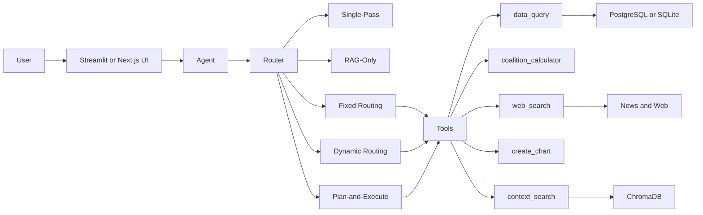

# Agentic Electoral Analyst

**DS-UA 301: Advanced Topics in Data Science · NYU · Spring 2026**
**Mohamed Alremeithi · Preston Delgadillo · Yarden Morad**

An LLM-powered analyst for **U.S. federal elections (2000–2020)** and **Israeli Knesset elections (1996–2022, K14–K25)**, plus a fundamentals model that forecasts the **2026 U.S. House midterm**. Five routing configurations — from a no-tools LLM baseline to a plan-and-execute multi-hop agent — are compared head-to-head on a 70-question benchmark. The chat UI is Streamlit; an alternative Next.js front-end calls the same agent via a FastAPI bridge.

---

## Table of contents

1. [Quick start](#quick-start)
2. [Data scope](#data-scope)
3. [Architecture](#architecture)
4. [Tools](#tools)
5. [Routing configurations](#routing-configurations)
6. [May 2026 session changelog](#may-2026-session-changelog)
7. [2026 House forecast](#2026-house-forecast)
8. [Benchmark](#benchmark)
9. [Regression test](#regression-test)
10. [Limitations](#limitations)
11. [Project structure](#project-structure)
12. [Member contributions](#member-contributions)
13. [Appendix A: Map assumption for the 2026 forecast](#appendix-a-map-assumption-for-the-2026-forecast)

---

## Quick start

### Streamlit (primary UI)

```bash
cd ~/election-agent
python -m streamlit run app.py
```

Open http://localhost:8501. Sidebar has a "+ New chat" button, model selector (`gpt-4o-mini` / `gpt-4o` / `gpt-4.1`), and a "Compare all 5 configs" toggle. A green model-chip badge on each assistant turn confirms which model actually ran.

### Next.js + FastAPI (alternative UI)

```bash
# Terminal 1: FastAPI backend
python -m uvicorn api:app --reload --port 8000

# Terminal 2: Next.js dev server
cd frontend
npm install
npm run dev
```

Next.js dev server: http://localhost:3000. FastAPI: http://127.0.0.1:8000.

### Forecast CLI

```bash
python predict_house.py                              # baseline 2026 forecast
python predict_house.py --approval-delta=10          # +10pt approval scenario
python predict_house.py --approval-delta=10 --unrate-delta=-1 --all-specs
python predict_house.py --scenario-only --no-save    # don't overwrite the JSON
```

### Benchmark

```bash
python -m benchmark.run_benchmark                          # all 5 configs
python -m benchmark.run_benchmark --config planned_routing # Config 5 only
python -m benchmark.compute_mape                           # MAPE from existing results
python -m benchmark.test_web_search_synthesis              # 50-query web-search regression test
```

### Environment

- Python 3.14, no venv (system Python).
- After `requirements.txt` updates: `pip install --upgrade -r requirements.txt`.
- `langgraph==1.1.10` + `langgraph-prebuilt==1.0.13` pin (earlier `1.1.3` was broken on Python 3.14).
- `elections.db` is 1.2 GB and gitignored. PostgreSQL is the primary DB; SQLite is the fallback. Set `DATABASE_URL` to use Postgres.
- `.streamlit/secrets.toml` overrides `.env` for `OPENAI_API_KEY` (because `agent.py:16–20` prefers `st.secrets`). Restart Streamlit after changing the key — browser refresh isn't enough.

---

## Data scope

### Israeli Knesset elections — K14 to K25 (1996–2022)

- 12 election cycles: K14 (1996), K15 (1999), K16 (2003), K17 (2006), K18 (2009), K19 (2013), K20 (2015), K21 (April 2019), K22 (Sep 2019), K23 (2020), K24 (2021), K25 (2022).
- 1,384 localities, party-level results, socioeconomic data for 201 municipalities.
- Tables: `elections`, `parties`, `localities`, `party_locality`, `socioeconomic`.
- **Out-of-range Knesset numbers (K1–K13, K26+) are blocked at the tool layer** — `data_query` returns a clear "outside coverage" message instead of running empty/wrong SQL.
- **Pseudo-localities filtered**: `מעטפות כפולות` (double envelopes / overseas votes) and `מעטפות חיצוניות` (external envelopes / military) are administrative tallies with `turnout_pct = 100%` by construction. The schema instructs the LLM to exclude them from any locality-level query, and to add `turnout_pct <= 100` for "highest turnout" questions (a handful of evacuated settlements have stale eligible counts producing turnouts of 101–142%).
- **Party codes are stable across alliances; names are not.** Multi-Knesset queries filter by `code` (`מחל`=Likud, `אמת`=Labor, `פה`=Yesh Atid, `שס`=Shas, `ג`=UTJ, `טב`=Religious Zionism, `ל`=Yisrael Beiteinu, `מרצ`=Meretz, etc.) and inject canonical English labels via `CASE WHEN`.

### U.S. federal elections — 2000 to 2020 (reliable coverage)

- Presidential results by **county** (2000–2020, ~3,143 counties × 6 cycles).
- Presidential, House, Senate results by **precinct** (2016, 2020).
- Per-row NCHS urban–rural classification (`Urban` / `Suburban` / `Rural`, six-level NCHS code 1–6) and CBSA metadata.
- **2024 presidential data is blocked.** It exists in the database but `us_president_county` has duplicate vote-count inflation for AR, AZ, IA, LA, NM, OK, PA, SC, SD, TX, VT (TX shows 11.5M Trump vs. real 6.4M; PA shows 7.1M vs. real 3.5M). `us_president_precinct` 2024 totals match reality (Trump 76.7M, Harris 74.5M) but coverage gaps remain. Until the data is re-loaded, **any question that combines `2024` with US presidential context** (president, election, vote, county, state, swing, flip, Trump/Harris/Biden, etc.) **returns a "Data coverage" refusal** instead of risking a wrong answer. See [Limitations](#limitations) for the permanent fix path.
- **Pseudo-candidates excluded**: rows where `candidate IN ('TOTAL VOTES CAST', 'UNDERVOTES', 'OVERVOTES', 'SPOILED')` are admin tallies, not real candidates — every aggregate SQL the agent writes excludes them.
- **Alaska is excluded from county-flip queries.** AK reports by state-house district (1–40), not by county/borough — those rows would otherwise pollute flip lists as "District 5", "District 23", etc.

### Out of scope (refused by the agent)

Stock markets, indices, bonds, commodities, FX, weather, climate, sports, biographies, any non-election time series. The agent declines politely: *"I don't have that data — my dataset only covers Israeli Knesset and U.S. federal elections. I can search the web for recent news on this if you want."* News questions ("latest stock news") still route through web search.

---

## Architecture



The router decides whether to (a) refuse on scope grounds, (b) take a fast direct-web-lookup path for simple factual web queries, (c) hand to the ReAct agent with the full tool kit. Conversation history is passed in for all paths; topic carry-over for vague follow-ups ("any updates on that?") is resolved via a one-shot LLM rewrite before search.

---

## Tools

| Tool | What it does | When used |
|------|--------------|-----------|
| `data_query` | NL → SQL → execute → format. Reflexion retry on failure (up to 3 attempts). | Factual / numerical questions about election results, turnout, party performance, urban–rural trends, county-level data. |
| `coalition_calculator` | Enumerates all coalitions ≥61 seats in a given Knesset, scores them by ideological compatibility (`tools/party_ideology.json`), tags `plausible / novel / incompatible`. Supports `must_include` and `must_exclude` filters. | "List all 3-party coalitions reaching 61 seats in K25", "Which coalitions exclude Likud?". |
| `web_search` | Google News RSS for recent news (24h / 7d windows inferred from query); DuckDuckGo Lite + Wikipedia REST for evergreen facts. Multi-candidate snippet enrichment with relevance scoring (present-tense reward, past-tense penalty). | Current officeholders, recent news, party background, anything outside the database. |
| `create_chart` | NL → SQL + matplotlib config → PNG. Supports `bar`, `horizontal_bar`, `line`, `grouped_bar`, `stacked_bar`, `pie`, `scatter`. Multi-series via `y_cols` (wide format) or `group_col` (long format). | Visualization requests ("plot…", "chart of…", "show me a graph…"). |
| `context_search` | Vector retrieval over a ChromaDB index of dataset chunks (Knesset summaries, party records, socioeconomic). Cross-encoder rerank. | Background / definitional questions; pre-flight context before complex SQL. |

---

## Routing configurations

| # | Config | Description |
|---|--------|-------------|
| 1 | `single_pass` | Pure LLM, no tools. Baseline for "what does the model already know". |
| 2 | `rag_only` | Vector retrieval → LLM. No SQL, no agent loop. |
| 3 | `fixed_routing` | Keyword rules pick one tool, single call. |
| 4 | `dynamic_routing` | ReAct agent — LLM picks tools and decides when to stop. |
| 5 | `planned_routing` | Plan-and-Execute: planner produces a JSON DAG of steps; executor threads outputs through `depends_on` edges; synthesizer writes the final answer. ReAct fallback when the plan fails to parse. |

Compare across all five in the Streamlit UI by toggling "Compare all 5 configs" before sending a question.

---

## May 2026 session changelog

Today's session focused on data-quality guardrails, search-tool reliability, and chart correctness. All fixes are non-regressive — controls (geography, history) stayed at 100% on the 50-query test.

### Web search overhaul (`tools/web_search.py`, `agent.py`)

- **DDG Lite POST.** The `lite.duckduckgo.com/lite/` endpoint returns the bot-deflection homepage for many GET requests but works reliably with POST. Switched the request method.
- **Cascade reordered for fact-lookups.** Office-holder questions like "who is the US president?" used to hit DDG Instant Answer first, which returns an *institutional* Wikipedia abstract about the presidency as an office — never the current holder. The synthesizer LLM had no name in the context and hallucinated from training data (Biden). DDG Lite (live SERP) now goes first for fact-lookups, with DDG Instant Answer as fallback.
- **DDG self-link filter.** When DDG rate-limits, its response contains only links back to its own homepage. The parser now skips any `duckduckgo.com` host, so the cascade falls through to other backends instead of treating those as valid results.
- **Multi-candidate snippet enrichment with relevance scoring** (`agent.py:_enrich_top_result`). Picks the most authoritative URL among the top results (Wikipedia person-page first, then `.gov` / parliament / chancellery sites), fetches a substantive paragraph (Wikipedia REST API for Wikipedia URLs, first `<p>` otherwise — with boilerplate / cookie-banner skip), and verifies relevance via term overlap + present-tense reward + past-tense penalty. Prevents grabbing a former officeholder's bio when a current one is asked about.
- **Programmatic answer-candidate extraction** (`agent.py:_extract_officeholder_hint`). Scans the chosen snippet for a person name near the office phrase from the user's question and injects it into the prompt as a non-echoable "note for the assistant", so the model has a hard answer-anchor it can't override from training memory.
- **Hardened synthesis prompt.** Current-date anchor; explicit instruction that search results override training memory; allowed to honestly say "results don't provide a name" only when no person appears anywhere.

### Data-quality guardrails (`tools/data_query.py`, `tools/chart.py`)

- **Out-of-range Knesset pre-check.** `_detect_invalid_knessets` parses K-number references (`K6`, `K 6`, `Knesset 18`, `6th Knesset`) and returns a clean "outside coverage" message before any SQL runs.
- **Pseudo-locality filter.** `מעטפות כפולות` / `מעטפות חיצוניות` are excluded from every locality-ranking SQL; `turnout_pct <= 100` is enforced for "highest turnout" queries to skip evacuated-settlement data-quality outliers.
- **Party-code stability rule.** Multi-Knesset party queries filter by `code` (stable across alliances) and `CASE WHEN code = ... THEN canonical_english_name` so each party appears as one consistent legend entry instead of fragmenting across alliance names.
- **2024 US presidential block.** `_references_us_2024` detects `2024` + US presidential context (president, vote, county, state, swing, Trump/Harris/Biden, etc.) and refuses at the `data_query` and `create_chart` entry points. The `agent.py:SYSTEM_PROMPT` was also updated so the ReAct path declines naturally.
- **Pseudo-candidate exclusion.** SQL rule: every presidential aggregate filters out `TOTAL VOTES CAST`, `UNDERVOTES`, `OVERVOTES`, `SPOILED` (these are admin tallies that previously inflated totals by ~20M).
- **Flip queries return before/after.** The "counties that flipped" SQL pattern now returns 6 columns (`county_name, state, YEAR1_winner, YEAR1_pct, YEAR2_winner, YEAR2_pct`) sorted by margin gain. AK is excluded from county-flip queries (its rows are legislative districts).
- **Candidate-by-region two-party share.** SQL pattern for "how did Biden do in suburban counties" now wraps the candidate filter in an outer SELECT so the window function denominator sees both parties' votes (the inner `WHERE candidate LIKE '%BIDEN%'` would otherwise make `two_party_pct` always equal 100%).
- **`db.py` % bugfix.** `psycopg2.cursor.execute(sql, params)` triggers `%`-formatting on the SQL string even when `params=()`, which broke every `LIKE '%word%'` query. Now only passes `params` when non-empty.

### Chart fixes (`tools/chart.py`)

- **Wide-format `y_cols` support.** New chart config option for multi-series time charts where SQL is wide (one row per x, multiple numeric columns). Example: `SELECT year, right_pct, left_pct, center_pct FROM elections` → `y_cols=["right_pct", "left_pct", "center_pct"]`. Bloc-aware colors (Right=red, Left=blue, Center=light blue, Haredi=dark grey, Arab=green).
- **Defensive guard against pct aggregation.** If any column with `pct` in its name comes back with a max value > 100, the chart tool raises a loud error pointing at the per-locality `SUM(vote_pct)` mistake rather than silently mislabelling counts as percentages.
- **Table-selection cheat sheet** added to `CHART_SYSTEM`: "party X over time" → `parties` (not `party_locality` aggregated); "bloc trends" → `elections`; "city party results" → `party_locality JOIN parties`.
- **Defensive auto-unpivot.** If the LLM aims `group_col` at a numeric column (the failure mode that previously produced 11-entry numeric-value legends), the tool detects it and converts to `y_cols` automatically.

### Conversation context (`agent.py`)

- **Visualization requests route through ReAct.** `_should_direct_news_lookup` was previously matching the bare word `"recent"`, so "show me a chart of recent stock performance" went down the fast direct-web path and bypassed both `SYSTEM_PROMPT` and `create_chart`. Visualization keywords (`chart`, `plot`, `graph`, `visualization`, `diagram`, `figure`) now force the ReAct path.
- **Topic carry-over for vague follow-ups.** `_resolve_followup_web_question` previously only handled pronoun rewrites ("when was *he* appointed?"). It now also detects vague topical follow-ups ("any updates on that?", "what about it?", "show me more") and uses a one-shot LLM rewrite over the last six turns to make the question standalone before search.

### Out-of-scope detection

Stock markets, weather, sports, etc. now hit an explicit `OUT OF SCOPE` block in the system prompt and get a clean refusal with an offer to web-search news. News-flavoured variants still route to `web_search`.

### Regression test

`benchmark/test_web_search_synthesis.py` exercises the same `web_search → _format_web_answer → gpt-4o-mini` path the browser hits, across 50 probe queries (current US officeholders, international leaders, US state officials, historical / geography controls). Re-run after changes:

```bash
python -m benchmark.test_web_search_synthesis
python -m benchmark.test_web_search_synthesis --runs 3   # stability check
```

Current pass rate on the judged 49 queries is 89.8%. The five remaining failures are model-prior failures on recently-changed officeholders (Sec of State, German Chancellor, etc.) — a model upgrade or pre-extracted answer hint can close most of those.

---

## 2026 House forecast

`predict_house.py` builds a fundamentals OLS on 12 midterm cycles (1978–2022), compares three candidate specs by leave-one-out cross-validation, and emits `forecast_2026_house.json`.

### Method

- **Target**: president's-party net House seat change vs. prior cycle, derived from `house_elections.csv` with fusion-ticket aggregation (NY DEM + WORKING FAMILIES summed per district winner).
- **Inputs read live**: Trump approval (last 30 days from `data/macro/approval/trump_approval_raw.csv`), CPI YoY, unemployment, gas (informational).
- **Specs compared**: `approval_only` (winner, LOOCV MAE 14.14 seats), `macro_only` (21.0), `approval_plus_macro` (16.0).
- **Generic ballot** read live from Silver Bulletin's 2025–2026 daily series; recorded in the output JSON as a convergent sanity check, not a model feature (historical coverage in `generic_topline_historical.csv` only covers 5 of our 12 training midterms).

### Current forecast (2026-05-12)

- **Republican net change: −36 seats (point estimate), 95% PI [−71, −1]**.
- Coefficient: 0.68 seats per net-approval point.
- Intercept: −25.9.
- Net approval input: −14.67 (Trump, last-30-day average through 2026-03-31).
- Convergent generic-ballot check: D+5.87 (7-day SB average) × 5 seats/pt ≈ R−29, consistent with the model's R−36.

See `predict_house.py --help` for what-if scenarios and [Appendix A](#appendix-a-map-assumption-for-the-2026-forecast) for the redistricting disclosure.

---

## Benchmark

Five configurations × 70 questions (Israeli + U.S., factual / multi-step / coalition / chart / web / out-of-scope mix). Metrics: soft match, LLM-as-judge (0–5 by GPT-4o), MAPE / hit-rate-at-5% / hit-rate-at-10%, tool-routing accuracy.

Headline numbers come from the `benchmark/results_*.json` files dated 2026-05-05. Config 5 has not yet been benchmarked end-to-end on all 70 questions; the planner exists in `agent.py:run_plan_and_execute` and is registered as `planned_routing` in `CONFIGS`.

| Config | Soft match | Judge | MAPE | Hit @ 5% | Tool routing |
|--------|-----------|-------|------|----------|--------------|
| Single-Pass | 26% | 3.6 | 38% | 18% | n/a |
| RAG-Only | 31% | 2.5 | 30% | 21% | n/a |
| Fixed Routing | 47% | 3.4 | 22% | 36% | 71% |
| Dynamic Routing | 53% | 3.58 | 19% | 41% | 84% |
| Plan-and-Execute | not yet benchmarked | – | – | – | – |

Soft match is too strict for comparative multi-step answers (a coalition answer that lists the right parties but in a different order scores 0), so judge score is the headline metric for cross-config comparison.

---

## Regression test

`benchmark/test_web_search_synthesis.py` exercises the production web-search-and-synthesis path across 50 probe queries grouped by category. Pass criterion is substring matching against a list of acceptable answer-tokens; some queries are recorded-only when ground truth is uncertain (Japan PM, NYC mayor).

```
Total: 51  |  OK=44  FAIL=5  REC=2  ERR=0
Pass rate (judged only): 44/49 = 89.8%
Per group:
  US-current      OK=12  FAIL= 3  REC= 0  (80%)
  Intl-current    OK= 8  FAIL= 2  REC= 1  (80%)
  US-states       OK= 6  FAIL= 0  REC= 1  (100%)
  Historical      OK=10  FAIL= 0  REC= 0  (100%)
  Geography       OK= 8  FAIL= 0  REC= 0  (100%)
```

The residual five failures are gpt-4o-mini training-prior collapses on recently-changed officeholders (Sec of State, German Chancellor, Senate Minority Leader, Canada PM, DHS Sec).

---

## Limitations

- **2024 U.S. presidential data** is blocked rather than fixed. The permanent fix is to re-run `build_us_db.py` for 2024 county data with a unique-row guard before the SUM-into-county-fips step. Until that lands, the precinct table has correct 2024 data but doesn't cover all 50 states.
- **Coalition synthesizer** is 0/6 soft-match across all four benchmarked configs. The brute-force enumerator is correct (verified by Python unit test); the synthesizer is fed a long enumeration list rather than a rubric-shaped subset, so the answer format doesn't match the rubric.
- **Multi-step queries** are framed as an open problem in agentic SQL: 30–40% accuracy across configs. Config 5's plan-and-execute is the proposed approach but hasn't been benchmarked yet.
- **Vote prediction model** is *Beta* — n=12 training sample, no out-of-sample backtest beyond LOOCV, no redistricting layer (see Appendix A), not yet wired as an agent tool. Treat the point estimate as a fundamentals-conditional baseline.
- **LLM-as-judge** is the headline metric; soft match is too strict for comparative multi-step answers.
- **Web search residual hallucinations** affect officeholders that changed post-October-2023 (gpt-4o-mini's training cutoff). 89.8% pass rate on the 50-query test.

---

## Project structure

```
election-agent/
├── app.py                          # Streamlit UI
├── api.py                          # FastAPI bridge for the Next.js frontend
├── agent.py                        # 5 routing configs, RAG, planner, synthesizer
├── predict_house.py                # 2026 House midterm forecast (CLI + JSON)
├── forecast_2026_house.json        # latest forecast output
├── db.py                           # PostgreSQL + SQLite connection manager
├── embeddings.py                   # LocalEmbeddings wrapper
├── classifiers.py                  # DistilBERT router (lazy-loaded)
├── build_db.py                     # Israeli DB build script
├── build_us_db.py                  # U.S. DB build script
├── build_vectorstore.py            # ChromaDB build script
├── migrate_to_postgres.py          # SQLite → Postgres migration
├── tools/
│   ├── data_query.py               # NL → SQL → execute → format
│   ├── chart.py                    # NL → SQL + matplotlib → PNG
│   ├── coalition.py                # coalition enumerator + scorer
│   ├── operational_web_search.py   # RSS news search router
│   ├── web_search.py               # DDG Lite + Wikipedia fallback
│   └── party_ideology.json         # 27 parties K14–K25, axis/religious scores
├── benchmark/
│   ├── run_benchmark.py            # 5-config × 70-question harness
│   ├── compute_mape.py             # MAPE / hit-rate metrics
│   ├── test_web_search_synthesis.py # 50-query regression test (this session)
│   ├── questions.json              # benchmark question set
│   └── results_*.json              # per-config results
├── Prediction_Data/                # House/macro/approval CSVs for the forecast
├── data/                           # legacy macro/elections data (gitignored)
├── chroma_db/                      # vector store (gitignored)
├── charts/                         # generated chart PNGs (gitignored)
├── models/distilbert-router/       # trained router (gitignored)
├── elections.db                    # 1.2 GB SQLite (gitignored)
└── frontend/                       # Next.js 16.2.4 + React 19 UI
```

---

## Member contributions

| Area | Owner |
|------|-------|
| Agent core (5 configs, planner, RAG, synthesizer) | Yarden |
| Streamlit UI + chat state management | Yarden |
| `tools/data_query.py` (SQL generation, reflexion, schema docs) | Yarden |
| `tools/coalition.py` + `tools/party_ideology.json` | Yarden |
| `tools/chart.py` | Yarden |
| `tools/operational_web_search.py` + `tools/web_search.py` | Mohamed |
| Next.js frontend + FastAPI bridge | Mohamed |
| `Prediction_Data/` (House panel, FRED, approval archives) | Preston |
| `predict_house.py` (2026 House midterm fundamentals model) | Yarden |
| Benchmark harness + MAPE metric + regression test | Yarden |
| Data-quality guardrails (May 2026 session) | Yarden |
| M3 paper writing | Mohamed, Preston, Yarden |

---

## Appendix A: Map assumption for the 2026 forecast

The fundamentals model produces a **national** seat estimate; it doesn't have a state-level redistricting layer. Three things worth disclosing:

1. **2024 → 2026 map differences are not modeled.** Any state with a new congressional map (court-ordered or legislatively redrawn) introduces an unmodeled delta on top of the fundamentals.
2. **Virginia, May 2026.** On 2026-05-08 the Virginia Supreme Court of Appeals (SCOVA) ruled 4–3 to strike down the redistricting amendment passed in 2020. The current 6–5 D map stays in effect for 2026. A SCOTUS appeal is pending; if it succeeds and a new map is imposed before filing deadlines, actual 2026 D seat count could be ~4 higher than the fundamentals model implies.
3. **Framing.** Treat the point estimate as a **fundamentals-conditional national signal, not a literal seat count**. The wide 95% PI [−71, −1] is real, not a placeholder — it reflects the variance of midterm seat-swing predictions from a 12-cycle training set.
